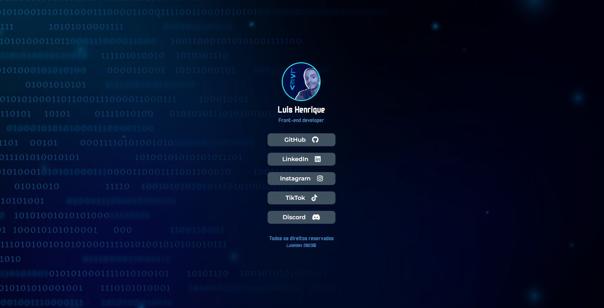

<h1 align="center"> Página de links </h1>

  <a href="#-tecnologias">Tecnologias</a>&nbsp;&nbsp;&nbsp;|&nbsp;&nbsp;&nbsp;
  <a href="#-projeto">Projeto</a>&nbsp;&nbsp;&nbsp;|&nbsp;&nbsp;&nbsp;
  <a href="#memo-licença">Licença</a>

  

 

  

## 🚀 Tecnologias

Esse projeto foi desenvolvido com as seguintes tecnologias:

- HTML e CSS
- SASS
- Figma
- Git e Github

- [Acesse o figma do projeto](https://www.figma.com/file/FrxeJtxwxxUOHylvKTgkQf/Wireframe-linktree?type=design&node-id=0%3A1&mode=design&t=Sfjtlf39xvsbTXaw-1)

## 💻 Projeto

Essa página de links foi desenvolvida seguindo minha necessidade de agrupar os meus principais links e para praticar e desenvolver mais minhas habilidades em Sass, optei pela criação ao invés de usar um software pronto como Linktree por exemplo. 

 - [Visite o projeto online](https://luishdev.github.io/Meus-Links/)

## :memo: Licença

Esse projeto está sob a licença MIT.

---

Feito com ♥ by LuisHdev :wave: [Acesse meu linkedin!](linkedin.com/in/luis-henrique-a5a086250/)
